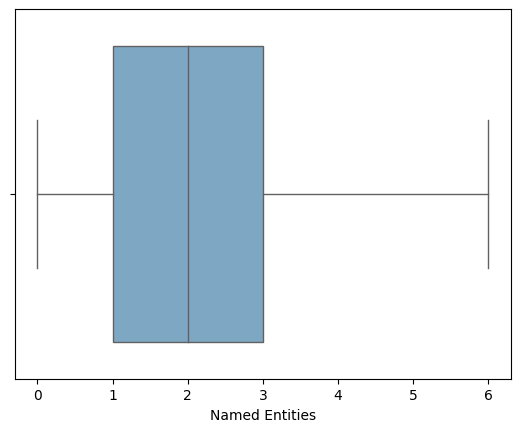
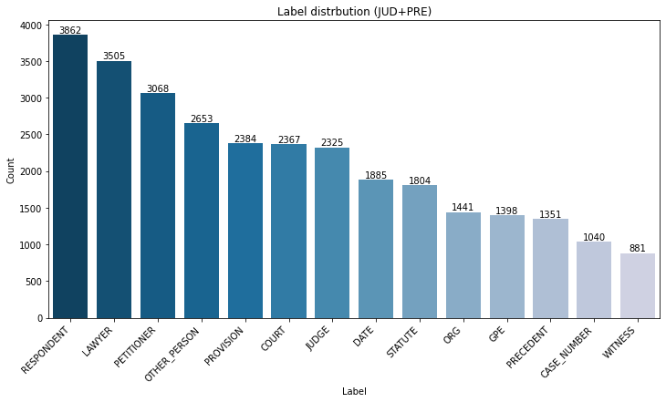
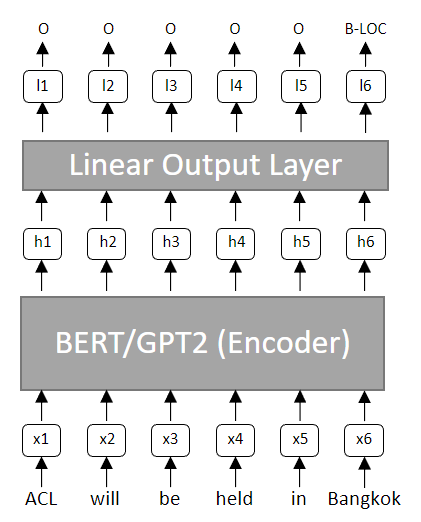
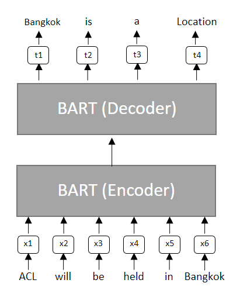
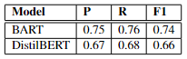
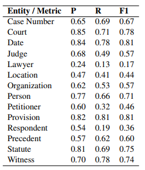
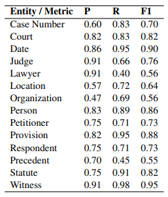

# Named Entity Recognition on Indian Legal Documents using BERT and BART
Models trained to perform Named Entity Recognition on generic datasets may not do as well on domain-specific textual data. This implementation compares the performance of two different transformer-based neural network models for the task of named entity recognition (NER) on Indian court judgments. Pre-trained BERT, and BART models are fine-tuned with thousands of sentences sampled from publicly available court documents. The goal is to develop and compare models that are able to identify 14 specific named entities (NE) in unstructured text documents, such as people names, organizations, dates, locations, and more.
    
## Repository guide
This repository contains the source code for fine-tuning BERT and BART for Named Entity Recognition on Indian court judgement texts.

- **./data** contains all the data that was used to train and evaluate the models
- **./data_analysis** contains a notebook with the data analysis
- **./src** contains the complete source code for the implementation of the models, the training, and the evaluation can be found. Each model has its own subdirectory. 
- **./util** contains additional utility functions used mainly by the BART model. BERT is implemented in Jupyter notebooks, whereas BART is implemented in plain Python files.

# Dataset
## General information
11 thousand sentences of varying lengths from Indian court judgments were used to familiarize BERT and BART with the Indian legal domain. This data was provided as part of the SemEval-2023 paper "LegalEval: Understanding Legal Texts" (Kalamkar et al., 2022).

Each sentence was selected from documents published on IndianKanoon, and priority was given to documents with a higher citation count. The training data for the model was sourced from documents spanning 1950 to 2017, while the testing data covers the more recent period from 2017 to 2021.

Ideally, each sentence should contain at least one named entity. However, this is not the case for 2179 of them. For the rest, the median of named entities per sentence is two, as shown in the box plot below.

_Note that outliers have been excluded from the graph due to a few sentences containing as many as 68 named entities_

Each of the 29964 named entities in the training dataset falls into one of the 14 different categories:  respondent, lawyer, petitioner, other person, provision, court, judge, date, statute, organization, location, precedent, case number, or witness. In the figure below you can see the count of all 14 named entities in the dataset.

## Data format: Index-based to IOB
Each JSON file contains a list of documents, each containing a sentence and information about the location of named entities in that sentence (start & end indexes).

An index-based annotation of named entities is useful when working spaCy; however, that is not the case with the BERT and BART, which expect data in a specific format known as IOB (Inside-Outside-Beginning) tagging.

**How IOB tagging works:** Given a chunk of text, every word that is not part of a named entity is labeled as 'O'. Furthermore, words that belong to a certain named entity are labeled based on their position within the named entity: the initial word gets labeled as a 'B-' and all subsequent words as 'I-'. 

Finally, to differentiate among different named entities, labels 'B-' and 'I-' are then followed by a specific named entity label. For example, the corresponding tags for the sentence "High Court of Mumbai in India" would be [B-COURT I-COURT I-COURT I-COURT O B-GPE]

# Experiments
This project considers BERT and BART, both pre-trained models with a transformer-based architecture (see details in pictures below).

## BERT

Unlike typical transformer-based models that employ both encoder and decoder parts of the encoder-decoder architecture, BERT utilizes only the encoder and ignores the decoder. The encoder has multiple self-attention layers, which help a token determine the importance of any other token in a given context .

BERT comes in three different versions, which are architecturally similar to each other, and distinguishable mainly based on their size and resource requirements. To accommodate the constraints of limited time and processing power, we use DistilBERT as it requires the least computational. resources among the three versions.

## BART
BART is a sequence-to-sequence model developed in 2019, and it differs architecturally from BERT. While the latter employs only the encoder layer, BART also has a decoder layer, which leads to different output formats.
Furthermore, since BART is a generative model, it does not explicitly perform classification the way NER tasks require, meaning that it does not output a class for each input token. Instead, it generates a sentence that has a named entity inside it.

# Results
BART performed better than BERT, with macro F1 scores of 0.74 and 0.66, respectively. The models showed overfitting tendencies within very few epochs of training.

BERT scored best with the labels DATE and PROVISION, with an F1 score of 0.81. The lowest-scoring label is LAWYER, with an F1 score of only 0.17. 

BART, on the other hand, got an F1 score of over 0.5 on all entities. The highest F1 score was achieved with the label WITTNESS (0.95), whereas the lowest one turned out to be the label PRECEDENT (0.55).

